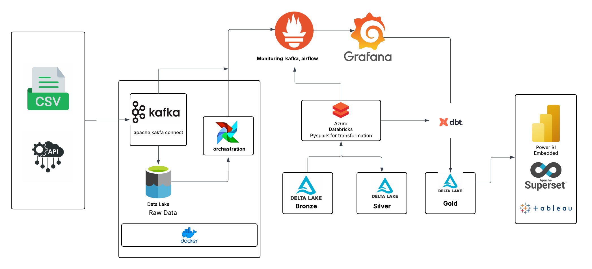

# Data Pipeline System Design

This repository provides documentation for a robust and scalable data pipeline system built to efficiently ingest, process, store, and visualize data. The architecture leverages a blend of open-source technologies and cloud services, following the Medallion Architecture (Bronze, Silver, Gold layers) for data management.

## 🔧 System Architecture Overview

The diagram below illustrates the end-to-end data flow — from ingestion to visualization:



### 📌 Key Components & Workflow

#### 1. **Data Sources**
- **CSV Files**: Static structured data.
- **APIs**: Real-time or batch-based external data.
- **Raw Data (Data Lake)**: Initial unprocessed data stored in a lake for ingestion.

#### 2. **Data Ingestion**
- **Apache Kafka**: Manages high-throughput, real-time data ingestion.
  - **Kafka Connect**: Integrates Kafka with external systems.
- **Apache Airflow**: Schedules and orchestrates data ingestion workflows.

#### 3. **Data Processing**
- **Azure Databricks (PySpark)**: Performs distributed data transformation and analytics.
  - Ingested data from Kafka is processed and structured using PySpark.

#### 4. **Data Storage (Medallion Architecture)**
- **Delta Lake**: Ensures reliable, ACID-compliant data storage.
  - **Bronze Layer**: Raw ingested data.
  - **Silver Layer**: Cleansed and enriched data.
  - **Gold Layer**: Aggregated and analytics-ready data.

#### 5. **Monitoring**
- **Grafana**: Monitors performance and health metrics of the pipeline (Kafka, Airflow, etc.).

#### 6. **Data Transformation & Visualization**
- **dbt (Data Build Tool)**: Applies SQL-based transformations on the Gold layer.
- **Power BI**, **Superset**, **Tableau**: Enable interactive dashboards and deep insights.

#### 7. **Deployment**
- **Docker**: Containerizes the pipeline for seamless deployment across environments.

## 🔁 End-to-End Workflow

1. **Ingestion**: Data is sourced from CSVs, APIs, and a data lake, and then pushed to Kafka via Kafka Connect. Airflow manages the schedule.

2. **Processing**: Kafka streams data into Azure Databricks. PySpark processes and stores the data in Delta Lake across Bronze, Silver, and Gold layers.

3. **Monitoring**: Grafana tracks system metrics and alerts on anomalies.

4. **Transformation & Analytics**: dbt runs SQL transformations on Gold data. Visualization tools (Power BI, Superset, Tableau) consume the transformed data for analysis.

5. **Deployment**: Docker ensures consistent, environment-agnostic deployment.

## 🛠️ Technology Stack

- **Data Ingestion**: Apache Kafka, Kafka Connect
- **Orchestration**: Apache Airflow
- **Processing**: Azure Databricks with PySpark
- **Storage**: Delta Lake (Bronze, Silver, Gold)
- **Monitoring**: Grafana
- **Transformation**: dbt
- **Visualization**: Power BI, Superset, Tableau
- **Deployment**: Docker

## 🚀 Setup & Installation

### Prerequisites
- Docker installed
- Access to Azure Databricks and Delta Lake
- Configured instances of Kafka and Airflow (preferably containerized)
- Grafana, and at least one BI tool (Power BI, Superset, or Tableau)

### Installation Steps

1. **Clone the Repository**
   ```bash
   git clone https://github.com/your-username/data-pipeline.git
   cd data-pipeline
   ```

2. **Set Up Docker Containers** (for Kafka, Airflow, etc.)
   - Use Docker Compose or custom scripts as per the provided templates.

3. **Configure Airflow DAGs and Kafka Connectors**
   - Add your source configs and schedule data ingestion tasks.

4. **Connect Azure Databricks and Run PySpark Jobs**
   - Ensure proper access to Delta Lake and test data flow.

5. **Monitor with Grafana**
   - Set up dashboards to visualize performance metrics.

6. **Run dbt Transformations and Visualize Data**
   - Load transformed data into Power BI, Superset, or Tableau.

---
